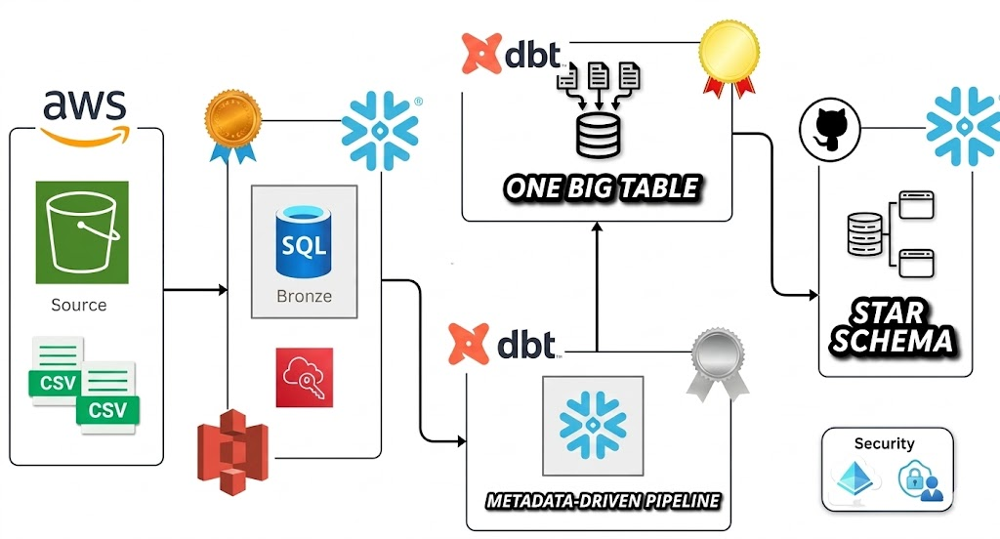

# 🏠 Airbnb Data Pipeline — End-to-End Data Engineering Project

[](https://www.snowflake.com/)
[](https://www.getdbt.com/)
[](https://aws.amazon.com/s3/)
[](https://www.python.org/)

A production-grade data engineering pipeline that processes Airbnb listings, bookings, and host data through a **Medallion Architecture** (Bronze → Silver → Gold) using **Snowflake**, **dbt**, and **AWS S3**. The project demonstrates incremental loading, SCD Type 2 tracking, custom Jinja macros, and data quality testing.



---

## 📋 Table of Contents

- [Architecture](#-architecture)
- [Tech Stack](#-tech-stack)
- [Data Flow](#-data-flow)
- [Project Structure](#-project-structure)
- [Medallion Architecture](#-medallion-architecture)
  - [Bronze Layer](#-bronze-layer--raw-data)
  - [Silver Layer](#-silver-layer--cleaned--enriched)
  - [Gold Layer](#-gold-layer--analytics-ready)
- [Snapshots (SCD Type 2)](#-snapshots--scd-type-2)
- [Custom Macros](#-custom-macros)
- [Data Quality Testing](#-data-quality-testing)
- [Getting Started](#-getting-started)
- [Usage](#-usage)

---

## 🏗 Architecture

```
┌─────────────┐     ┌─────────────┐     ┌──────────────────────────────────────────────────┐
│             │     │             │     │                  SNOWFLAKE                        │
│  CSV Files  │────▶│   AWS S3    │────▶│                                                  │
│  (Source)   │     │  (Storage)  │     │  STAGING ──▶ BRONZE ──▶ SILVER ──▶ GOLD           │
│             │     │             │     │  (Raw)      (Ingested) (Cleaned)  (Analytics)     │
└─────────────┘     └─────────────┘     │                                    │              │
                                        │                              SNAPSHOTS           │
                                        │                           (SCD Type 2 Dims)      │
                                        └──────────────────────────────────────────────────┘
                                                         ▲
                                                         │
                                                    ┌────┴────┐
                                                    │   dbt   │
                                                    │ (Trans- │
                                                    │ forms)  │
                                                    └─────────┘
```

---

## 🛠 Tech Stack

| Technology | Purpose |
|:-----------|:--------|
| **Snowflake** | Cloud data warehouse — stores and queries all data layers |
| **dbt (Data Build Tool)** | SQL-based transformation framework — models, tests, docs |
| **AWS S3** | Cloud object storage — staging area for raw CSV files |
| **Python 3.12+** | Runtime environment for dbt |
| **Git** | Version control and CI/CD readiness |

### Key dbt Features Used

- ✅ Incremental models with `unique_key` merge logic
- ✅ Snapshots for SCD Type 2 slowly changing dimensions
- ✅ Custom Jinja macros for reusable SQL logic
- ✅ Jinja templating (loops, conditionals, config-driven SQL)
- ✅ Source definitions and `ref()` lineage
- ✅ Data quality tests with configurable severity
- ✅ Custom schema naming override
- ✅ Ephemeral models for intermediate transformations

---

## 🔄 Data Flow

```
bookings.csv ──┐                  ┌─ bronze_bookings ─── silver_bookings ──┐
               │   COPY INTO      │                                        │
hosts.csv    ──┼──── S3 Stage ────┼─ bronze_hosts ────── silver_hosts ─────┼──▶ OBT ──▶ Fact Table
               │   (Snowflake)    │                                        │       │
listings.csv ──┘                  └─ bronze_listings ─── silver_listings ──┘       ▼
                                                                              Snapshots
                                                                           (dim_bookings,
                                                                            dim_hosts,
                                                                            dim_listings)
```

### Source Data

| File | Records | Description |
|:-----|:--------|:------------|
| `bookings.csv` | ~10K+ rows | Booking transactions with amounts, fees, status |
| `hosts.csv` | ~200+ rows | Host profiles with superhost status and response rates |
| `listings.csv` | ~500+ rows | Property details with location, type, and pricing |

---

## 📁 Project Structure

```
Airbnb_Snowflake_DBT_Data_Engineer_Project/
│
├── DDL/                                    # Snowflake DDL scripts
│   ├── ddl.sql                             # Database, schema, and table creation
│   └── resources.sql                       # S3 stage, file format, COPY INTO commands
│
├── SourceData/                             # Raw CSV source files
│   ├── bookings.csv
│   ├── hosts.csv
│   └── listings.csv
│
├── aws_dbt_snowflake_project/              # Main dbt project
│   ├── dbt_project.yml                     # Project configuration
│   ├── profiles.yml                        # Snowflake connection profile (template)
│   │
│   ├── models/
│   │   ├── sources/
│   │   │   └── sources.yml                 # Source definitions (AIRBNB.STAGING)
│   │   ├── bronze/                         # 🥉 Raw data ingestion layer
│   │   │   ├── bronze_bookings.sql
│   │   │   ├── bronze_hosts.sql
│   │   │   └── bronze_listings.sql
│   │   ├── silver/                         # 🥈 Cleaned & enriched layer
│   │   │   ├── silver_bookings.sql
│   │   │   ├── silver_hosts.sql
│   │   │   └── silver_listings.sql
│   │   └── gold/                           # 🥇 Analytics-ready layer
│   │       ├── obt.sql                     # One Big Table (denormalized)
│   │       ├── fact.sql                    # Star schema fact table
│   │       └── ephemeral/                  # Intermediate (non-materialized) models
│   │           ├── bookings.sql
│   │           ├── hosts.sql
│   │           └── listings.sql
│   │
│   ├── macros/                             # Reusable Jinja SQL functions
│   │   ├── generate_schema_name.sql        # Custom schema naming override
│   │   ├── multiply.sql                    # Numeric multiplication with rounding
│   │   ├── tag.sql                         # Price categorization (Low/Medium/High)
│   │   └── trimmer.sql                     # String cleaning (UPPER + TRIM)
│   │
│   ├── snapshots/                          # SCD Type 2 dimension tracking
│   │   ├── dim_bookings.yml
│   │   ├── dim_hosts.yml
│   │   └── dim_listings.yml
│   │
│   ├── analyses/                           # Ad-hoc analysis & Jinja examples
│   │   ├── explore.sql                     # OBT exploration query
│   │   ├── if_else.sql                     # Jinja conditional logic demo
│   │   └── loop.sql                        # Jinja for-loop demo
│   │
│   ├── tests/                              # Data quality tests
│   │   └── source_tests.sql                # Booking amount validation
│   │
│   └── seeds/                              # Static reference data (placeholder)
│
├── main.py                                 # Entry point script
├── pyproject.toml                          # Python dependencies
└── uv.lock                                # Dependency lock file
```

---

## 🏅 Medallion Architecture

### 🥉 Bronze Layer — Raw Data

**Materialization:** Incremental (merge on unique key)

The bronze layer ingests raw data from the staging schema with **minimal transformation**. Each model uses incremental loading to only process new records based on `created_at` timestamps.

```sql
-- Pattern: Incremental load with watermark filtering
{{ config(materialized='incremental', unique_key='booking_id') }}

SELECT * FROM {{ source('staging', 'bookings') }}


  WHERE created_at > (SELECT COALESCE(MAX(created_at), '1900-01-01') FROM {{ this }})

```

| Model | Source Table | Unique Key |
|:------|:------------|:-----------|
| `bronze_bookings` | `AIRBNB.STAGING.BOOKINGS` | `booking_id` |
| `bronze_hosts` | `AIRBNB.STAGING.HOSTS` | `host_id` |
| `bronze_listings` | `AIRBNB.STAGING.LISTINGS` | `listing_id` |

---

### 🥈 Silver Layer — Cleaned & Enriched

**Materialization:** Incremental

The silver layer applies business logic, data standardization, and enrichment transformations.

| Model | Key Transformations |
|:------|:-------------------|
| `silver_bookings` | Calculates `total_booking_amount` using the `multiply()` macro: `nights_booked × booking_amount` |
| `silver_hosts` | Standardizes `host_name` (replaces spaces with `_`); classifies `response_rate_quality` into 4 tiers |
| `silver_listings` | Cleans `property_type` via `trimmer()` macro (UPPER + TRIM); categorizes pricing via `tag()` macro |

**Response Rate Quality Classification:**

```sql
CASE 
    WHEN response_rate >= 95 THEN 'Very Good'
    WHEN response_rate >= 80 THEN 'Good'
    WHEN response_rate >= 50 THEN 'Fair'
    ELSE 'Poor'
END AS response_rate_quality
```

**Price Categorization (via `tag()` macro):**

| Price Range | Tag |
|:------------|:----|
| < $100/night | Low |
| $100–$199/night | Medium |
| ≥ $200/night | High |

---

### 🥇 Gold Layer — Analytics-Ready

**Two modeling approaches are implemented:**

#### 1. One Big Table (OBT)

A fully denormalized table joining all silver models using a **config-driven Jinja pattern**. The join configuration is defined as a list of dictionaries, making the SQL dynamic and maintainable:

```sql


SELECT  {{ config['columns'] }} 
FROM   
          {{ config['table'] }}
          LEFT JOIN {{ config['table'] }} ON {{ config['join_condition'] }}
         
       
```

#### 2. Star Schema Fact Table

The `fact.sql` model joins the OBT with SCD Type 2 dimension tables (`dim_listings`, `dim_hosts`) to create a proper dimensional model suitable for BI tools.

#### 3. Ephemeral Models

Three ephemeral (non-materialized) models extract domain-specific subsets from the OBT for use as CTEs in downstream queries:

- `ephemeral/bookings.sql` — Booking facts
- `ephemeral/hosts.sql` — Host dimensions
- `ephemeral/listings.sql` — Listing dimensions

---

## 📸 Snapshots — SCD Type 2

Slowly Changing Dimension (Type 2) snapshots track historical changes to dimension records. When source data changes, a new row is inserted and the previous row's `dbt_valid_to` is updated.

| Snapshot | Tracks Changes To | Unique Key | Strategy | Valid-To Default |
|:---------|:-----------------|:-----------|:---------|:-----------------|
| `dim_bookings` | Booking records | `BOOKING_ID` | `timestamp` | `9999-12-31` |
| `dim_hosts` | Host profiles | `HOST_ID` | `timestamp` | `9999-12-31` |
| `dim_listings` | Listing details | `LISTING_ID` | `timestamp` | `9999-12-31` |

All snapshots are stored in the `AIRBNB.GOLD` schema.

---

## 🔧 Custom Macros

| Macro | Description | Example Usage | Generated SQL |
|:------|:------------|:-------------|:-------------|
| `multiply(x, y, precision)` | Multiplies two columns with rounding | `{{ multiply('nights', 'amount') }}` | `round(nights * amount, 2)` |
| `trimmer(column)` | Uppercases and trims whitespace | `{{ trimmer('property_type') }}` | `UPPER(TRIM(property_type))` |
| `tag(column)` | Categorizes numeric values into Low/Medium/High | `{{ tag('price_per_night') }}` | `CASE WHEN ... END` |
| `generate_schema_name()` | Overrides dbt's default schema naming | _(automatic)_ | Uses custom schema name directly without prefix |

---

## ✅ Data Quality Testing

```sql
-- source_tests.sql: Warns if any booking amount is below $200
{{ config(severity='warn') }}

SELECT 1
FROM {{ source('staging', 'bookings') }}
WHERE BOOKING_AMOUNT < 200
```

---

## 🚀 Getting Started

### Prerequisites

- **Snowflake Account** — [Sign up for a free trial](https://signup.snowflake.com/)
- **AWS Account** — For S3 bucket storage
- **Python 3.12+** — Runtime for dbt
- **pip** or **uv** — Package manager

### 1. Clone the Repository

```bash
git clone https://github.com/anshlambagit/Airbnb_Snowflake_DBT_Data_Engineer_Project.git
cd Airbnb_Snowflake_DBT_Data_Engineer_Project
```

### 2. Set Up Python Environment

```bash
python -m venv .venv
source .venv/bin/activate        # Linux/Mac
# .venv\Scripts\Activate.ps1    # Windows PowerShell

pip install -e .
```

**Dependencies** (from `pyproject.toml`):
- `dbt-core >= 1.11.11`
- `dbt-snowflake >= 1.11.6`

### 3. Set Up Snowflake

Run the DDL scripts in your Snowflake console:

```sql
-- Step 1: Create database and tables
-- Execute DDL/ddl.sql

-- Step 2: Create S3 stage and load data
-- Execute DDL/resources.sql (update AWS credentials and S3 bucket)
```

### 4. Configure dbt Connection

Edit `aws_dbt_snowflake_project/profiles.yml` with your Snowflake credentials:

```yaml
aws_dbt_snowflake_project:
  target: dev
  outputs:
    dev:
      type: snowflake
      account: <your-account-identifier>   # e.g., xy12345.us-east-1
      user: <your-username>
      password: <your-password>
      role: ACCOUNTADMIN
      database: AIRBNB
      warehouse: COMPUTE_WH
      schema: STAGING
      threads: 4
```

### 5. Verify Connection

```bash
cd aws_dbt_snowflake_project
dbt debug
```

---

## 💻 Usage

```bash
# Run all models in dependency order
dbt build

# Run specific layers
dbt run --select bronze.*       # Bronze layer only
dbt run --select silver.*       # Silver layer only
dbt run --select gold.*         # Gold layer only

# Run snapshots (SCD Type 2)
dbt snapshot

# Run data quality tests
dbt test

# Generate and serve documentation
dbt docs generate
dbt docs serve
```

### Model Dependency Graph

```
source('staging', 'bookings') ──▶ bronze_bookings ──▶ silver_bookings ──┐
source('staging', 'hosts')    ──▶ bronze_hosts    ──▶ silver_hosts    ──┼──▶ OBT ──▶ Fact
source('staging', 'listings') ──▶ bronze_listings ──▶ silver_listings ──┘     │
                                                                              ▼
                                                                         dim_bookings
                                                                         dim_hosts
                                                                         dim_listings
```

---

## 📄 License

This project is licensed under the MIT License — see the [LICENSE](LICENSE) file for details.
